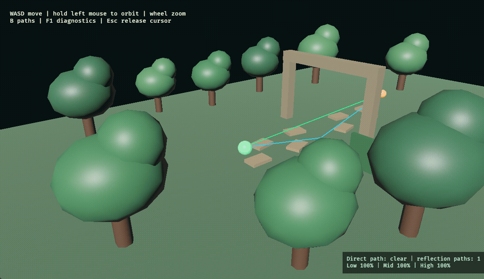
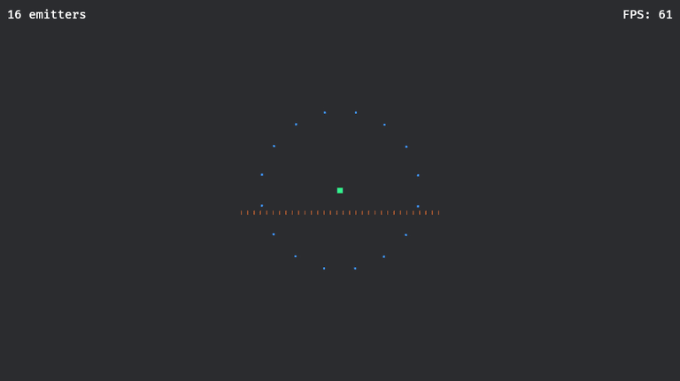
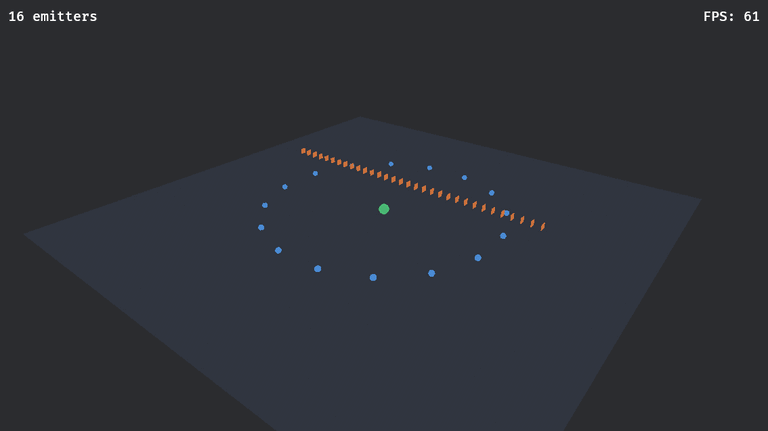

# Bevy Raytraced Audio

CPU acoustic path queries for Bevy, with separate 2D and 3D adapters. The
adapters are opt-in: existing `AudioPlayer`, `PlaybackSettings`, and Bevy audio
plugins keep controlling playback. Mark only the listeners, emitters, and
surfaces that should take part in acoustic queries.

**How it works:** at up to 30 updates per second by default, the adapter fires rays
outward from the listener and follows their bounces off your explicit surfaces, the approach
shown in Vercidium's [A First Look At Raytraced Audio](https://www.youtube.com/watch?v=u6EuAUjq92k).
Each bounce point checks for:

- **Occlusion (green rays):** line of sight to each source. The fraction of rays that find a
  source sets how clear or muffled it sounds. Hidden sources lose treble before bass.
- **Echo (blue rays):** line of sight back to the listener. Their surviving energy and lengths estimate
  reverb loudness, pre-delay, and decay time (Eyring RT60 from the mean free path).
- **Escape:** rays that leave the scene make the space sound outdoor. Their last echo point
  gives the direction outdoor ambience such as rain should come from (yellow rays).
- **Permeation (orange rays):** straight paths through walls lose energy at each crossed
  surface according to its per-band transmission, so thick walls muffle more than thin ones.

Play a sound with `RaytracedAudioPlayer` to hear the result. It decodes your Bevy `AudioSource`
through a lock-free low/high-frequency muffle filter and a small Schroeder reverb driven by the
trace, and lets one-shot reverb tails ring out. Plain `AudioPlayer` emitters still work; they get
volume-only muffling. With the `debug_draw` feature, `RaytracedAudio2dDebugPlugin` or
`RaytracedAudio3dDebugPlugin` animates the rays so you can watch them travel and bounce. GPU
tracing and mesh extraction are not implemented.

## Quick start

Choose one adapter crate. This example uses Bevy 0.19:

```toml
[dependencies]
bevy-raytraced-audio-2d = { git = "https://github.com/sagan-software/bevy-raytraced-audio", default-features = false, features = ["bevy_0_19"] }
```

Add its plugin next to your existing Bevy plugins, then opt in the relevant
entities:

```rust
use bevy::prelude::*;
use bevy_raytraced_audio_2d::{
    RaytracedAudio2dPlugin, RaytracedAudioEmitter2d, RaytracedAudioListener2d,
    RaytracedAudioPlayer,
};

fn configure_audio(app: &mut App) {
    app.add_plugins(RaytracedAudio2dPlugin::default());
}

fn spawn_audio(mut commands: Commands, asset_server: Res<AssetServer>) {
    commands.spawn((
        // `RaytracedAudioPlayer` makes muffling and reverb audible; `AudioPlayer` also works,
        // with volume-only muffling.
        RaytracedAudioPlayer::new(asset_server.load("audio.ogg")),
        PlaybackSettings::LOOP.with_spatial(true),
        RaytracedAudioEmitter2d,
        Transform::from_xyz(4.0, 0.0, 0.0),
    ));
    commands.spawn((
        RaytracedAudioListener2d,
        Transform::from_xyz(-4.0, 0.0, 0.0),
    ));
}
```

Default materials transmit zero amplitude. A source behind an opaque wall is still
heard when bounced rays find it (around a corner or through a doorway); a source
in a sealed room with opaque walls is silent. Give walls nonzero transmission to
let sound leak through them. For plain `AudioPlayer` emitters, set a fallback
linear gain for fully silent paths with
`RaytracedAudio2dPlugin::default().with_occluded_gain(0.15)?`. Tune ray counts and
bounces with `with_ray_tracing(RayTraceSettings)`, or call `without_ray_tracing()`
to use only the straight-line direct transmission.

Create a partially transmitting 2D surface like this:

```rust,ignore
let material = AcousticMaterial::default()
    .try_with_transmission(BandGain::try_new(0.2, 0.4, 0.6)?)?;
let wall = RaytracedAudioSurface2d::new(
    Vec2::new(0.0, -1.0),
    Vec2::new(0.0, 1.0),
    material,
)?;
```

Each amplitude transmission must be in `[0, 1]`. For each band, absorption
energy plus squared transmission amplitude must be at most `1`. The remaining
energy contributes to first-order reflections. Direct-path transmission
multiplies the gains of crossed surface primitives. The Bevy sink accepts one
linear volume value: direct-only playback uses the mean of the three bands,
while traced scalar playback uses the mean low/high muffle gains.
`RaytracedAudioPlayer` applies the frequency filter to the audio samples. A surface crossed by a
reflection leg still blocks that reflection, even when its direct transmission
is nonzero.

For headphone elevation cues, opt a 3D player into measured binaural rendering:
`RaytracedAudioPlayer::new(audio).with_binaural(0.22)`. The scale controls distance
rolloff and replaces Bevy's spatial scale for that voice. The adapter follows
the listener's world rotation and handles stereo output without double panning.
Materials can override diffuse reflection with `try_with_scattering`; their
band absorption drives bass/treble reverb decay. Furniture must have acoustic
surfaces to affect the trace.

Surface setup, error handling, and the corresponding 3D version are shown in
the [tutorial examples](docs/EXAMPLES.md).

Both plugins accept `AudioBackendPreference`. `Cpu` is the default. `Auto`
currently logs that GPU compute is unavailable and continues on CPU; the GPU
backend is not implemented yet.

For a Bevy 0.17, 0.18, or 0.20 project, set the adapter feature to `bevy_0_17`,
`bevy_0_18`, or `bevy_0_20`. Disable default features when selecting a version.
Use one Bevy adapter version per application. The current 0.20 adapter targets
`0.20.0-rc.2`; the [official release list](https://github.com/bevyengine/bevy/releases)
has no stable 0.20 release as of 2026-10-06.

## Browser examples

The [live gallery](https://sagan-software.github.io/bevy-raytraced-audio/)
builds nine separate WebAssembly pages, each with a description, controls, and
full Rust source. The featured sandbox is a CC0 modular village with operable doors/windows,
speech, basement/upstairs NPC footsteps, removable walls, and a stream/bridge.
Focused examples demonstrate door occlusion in 2D and 3D, room reverb, outdoor
ambience, and wall permeation; the forest and stress scenes remain available.
See the [example guide](docs/EXAMPLES.md) for every scene and its controls.
Each page checks WebGL2, canvas sizing, and successive WebGL draw activity before it reports the scene as ready. Bevy focuses its canvas during startup; the page prevents that focus from scrolling the sound control out of view. Click `Enable sound` once when the browser requires a user gesture. The button changes to `Mute sound` after a Bevy source connects to a running Web Audio output.

When Firefox cannot create a WebGL2 context, the example shows Firefox-specific hardware-acceleration recovery steps. Local headless Firefox could not create WebGL2, so regular Firefox with hardware acceleration remains unverified here.

In the sandbox, WASD walks, the humanoid faces the mouse, F switches to first
person, and E operates openings. Use 0–8 for isolated listening scenarios, X to
remove/restore a marked wall, V for rays, Tab for processing bypass, and H for
the guide. [The audit](docs/SANDBOX-AUDIT.md) describes confirmed fixes and the
limits of the acoustic model. **B** compares measured HRTF headphone cues with
stereo panning, **T** cycles tile/carpet/furnished rooms, and **J/K** plays a
clap/gunshot. See the [elevation and material research](docs/research/vertical-audio-and-materials.md).

The captures below predate the new ray tracer and show the earlier examples.
The forest walkthrough records the direct-path gain change as the listener moves across the brush screen:



The 2D stress capture shows 16 moving emitters against 32 wall segments:



The 3D stress capture shows 16 moving emitters against 32 wall triangles:



Both GIFs show continuous scene motion recorded from the hardware WebGL path.
See the [example guide](docs/EXAMPLES.md) for controls and workload sizes.

Run the native examples with:

```sh
nix run .#showcase
nix run .#demo-2d
nix run .#demo-3d
nix run .#reverb-2d
nix run .#ambience-2d
nix run .#permeation-2d
nix run .#stress-2d
nix run .#stress-3d
nix run .#forest-3d
```

## Supported versions

| Bevy adapter | Bevy version | Status                                     |
| ------------ | ------------ | ------------------------------------------ |
| `bevy_0_17`  | 0.17.3       | Feature and integration tested             |
| `bevy_0_18`  | 0.18.1       | Feature and integration tested             |
| `bevy_0_19`  | 0.19.1       | Default feature; examples use this version |
| `bevy_0_20`  | 0.20.0-rc.2  | Release-candidate compatibility only       |

The workspace MSRV is Rust 1.96.1. CI tests Rust 1.96.1, 1.97.1, 1.98.1, and
1.99.0. The local verification host uses Rust 1.99.0. See the
[compatibility notes](docs/COMPATIBILITY.md) for the tested matrix and release
sources.

## Build and verification

Nix supplies the native Bevy libraries, Rust tools, benchmark runner, browser
toolchain, and Markdown book builder:

```sh
nix develop
nix build
nix run .#check
nix flake check
```

Build the browser gallery and book locally, then serve them on
`http://127.0.0.1:8000`:

```sh
nix run .#web-build
nix run .#web-serve
```

Run the test suite and Criterion workload set with:

```sh
nix run .#test
nix run .#bench -- --quick --noplot
```

The 2026-10-06 local check passed 108 workspace tests and reports 99.07% line
coverage, 98.43% region coverage, and 99.57% function coverage. Criterion
completed all 34 workloads declared by the benchmark suite. These figures
describe code coverage and named workload execution; they do not certify
real-time audio quality or rendered frame rate. See
[testing and benchmark results](docs/TESTING-AND-BENCHMARKS.md).

## Performance status

On the local Intel Core i7-8565U laptop CPU, the 2026-10-06 quick benchmark
measured the 16-emitter/32-surface stress schedule at 73.98 microseconds in 2D
and 78.62 microseconds in 3D with the task pool. The serial path measured
77.20 microseconds and 81.42 microseconds. At 64 emitters and 64 surfaces, the
task-pool estimates were 118.73 microseconds in 2D and 145.18 microseconds in
3D; serial estimates were 121.46 microseconds and 146.44 microseconds. These
are short quick-run estimates.

The 128/256 schedule measured 0.445 ms in 2D and 0.621 ms in 3D. The 256/1,024
schedule measured 4.684 ms and 5.632 ms. Each pair lists 2D, then 3D.

The adapter processes fewer than 16 emitters sequentially. At 16 or more, it
uses Bevy's parallel query when the compute task pool is initialized. Without
that pool, it falls back to sequential processing. A separate 30-sample
comparison measured the serial 256/1,024 schedule at 10.726 ms in 2D and
13.043 ms in 3D. The parallel path measured 5.508 ms and 6.006 ms under the
same Bevy multithreaded setup.

Each measured adapter update schedule fits within the 11.11 ms time available
to a 90 FPS frame on this CPU. These measurements exclude rendering, audio
output, and browser presentation.

On an Intel UHD Graphics 620, Chromium's uncapped browser animation-frame
callbacks cleared 90 FPS in all five example routes. Each route had three
one-second samples at a 1,215 × 700 canvas size. The run used ANGLE Vulkan with
frame limiting and GPU VSync disabled.

| Browser route | Callback range per second |
| ------------- | ------------------------: |
| Forest 3D     |                   222–225 |
| Minimal 2D    |                   267–272 |
| Minimal 3D    |                   196–200 |
| Stress 2D     |                   256–277 |
| Stress 3D     |                   242–248 |

These samples measure browser animation-frame callbacks, not physical display
presentation. Normal headless synchronization caps callbacks near 60 FPS on the
60 Hz test display. Native window rendering and 90 Hz physical presentation
remain unverified. See the [test method and remaining limits](docs/TESTING-AND-BENCHMARKS.md).

## Documentation

- [Markdown book](docs/README.md)
- [Architecture and invariants](docs/DESIGN.md)
- [Example catalogue](docs/EXAMPLES.md)
- [Bevy and Rust compatibility](docs/COMPATIBILITY.md)
- [Tests and benchmark results](docs/TESTING-AND-BENCHMARKS.md)
- [Nix commands](docs/NIX.md)
- [Sagan Dylints setup](docs/DYLINTS.md)
- [Research and sources](docs/research/README.md)
- [Delivery plan and remaining work](docs/PLAN.md)

## License

The code is available under the MIT license. See [LICENSE](LICENSE).
